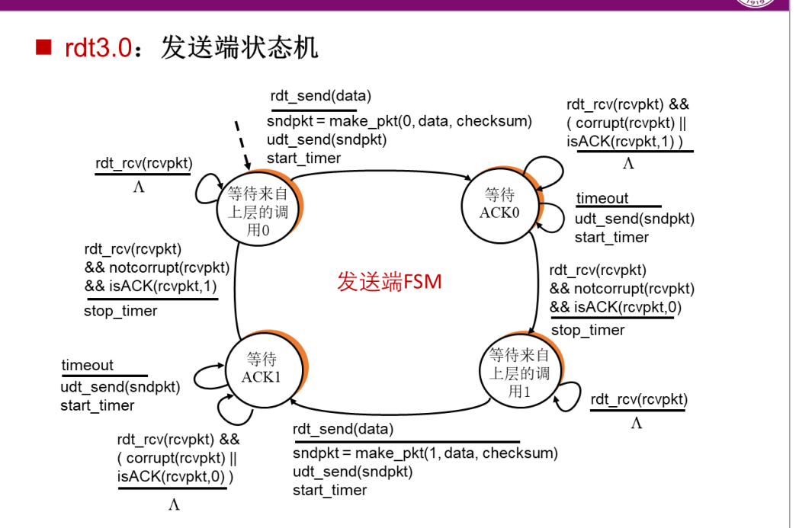

## UDP可靠传输 -- Part 01

利用数据报套接字在用户空间实现面向连接的可靠数据传输，功能包括：建立连接、差错检测、接收确认、超时重传等。流量控制采用停等机制，完成给定测试文件的传输。


## 实验要求分析

#### 如何建立面向连接的可靠传输

##### 		 目的面向连接的传输，虽然UDP本身是无连接的，但可以在应用层模拟出连接的概念，从而保证通信双方信息的**可靠**和**顺序**。

- **首先**保证信道的可靠，那么在正式通信前要保证连接的建立，可以模仿TCP的三次握手机制（但其实我们只涉及到Reciver和Sender，两次够用）；在结束通信后，确认不再有消息后，双方进行挥手关闭端口、释放socket资源。
- **其次**是数据的可靠和顺序，实验使用`rdt3.0`自动机的停等机制、使用0、1两个状态转移已经保证了数据包的顺序，而可靠性则通过自动机提到的**校验和**以及**超时重传**机制进行保证


#### 连接的建立和消亡

在开始传输数据之前，客户端和服务器可以交换控制消息来建立这种“虚拟连接”。涉及到发送一个特殊的`SYN`（同步）数据包，然后由接收方回复一个`SYN-ACK`数据包，最后客户端发送一个`ACK`数据包来确认；传输完毕，发送端完成发送决定关闭连接，发送`Fin`包，接受端回复同意，发送`<Fin, Ack>`，最后发送端收到回复`Ack`。

#### 差错检验和回复

- 使用序列号和确认机制检测丢包。本次实验序列号即状态机的0/1，但是为了后续动态窗口，这里提出序列号概念以供后续扩展。
- 使用校验计算计算数据在传输过程中是否损坏，使用上课中学习的累加的方式计算。

#### 停等机制和接受确认

一问一答形式，Reciver每次发送一个数据包，接受端回复Ack。

#### 超时重传

发送端采取如下状态机方式，每次发送完一组数据开始计时，若超时重新发送；接受端不设计计时。

##### 状态机如下




## 程序设计

UDP报文格式

```
 0              7 0             7 0                            15
+---------------------------------------------------------------+
|      Flag     |     Code      |          Checksum             |
+---------------------------------------------------------------+
|                         Sequence Number                       |
+---------------------------------------------------------------+
|                     Acknowledgment Number                     |
+---------------------------------------------------------------+
|           Payload Length        |       Header Length         |
+---------------------------------------------------------------+
|                             Data                              |
+---------------------------------------------------------------+
```

| 字段名称              | 大小 (位) | 描述                             |
| --------------------- | --------- | -------------------------------- |
| Flag                  | 8         | 0 ... SYN  ACK  FIN              |
| Code                  | 8         | 子类型或额外的控制信息           |
| Checksum              | 16        | 整个报文的校验和                 |
| Sequence Number       | 32        | 报文的序列号 这次实验，只有0-1   |
| Acknowledgment Number | 32        | 确认序列号 这次实验没用,保留扩展 |
| Payload Length        | 16        | Data的长度                       |
| Header Length         | 16        | 报文头部的长度                   |
| Data                  | ——        | 实际数据                         |


