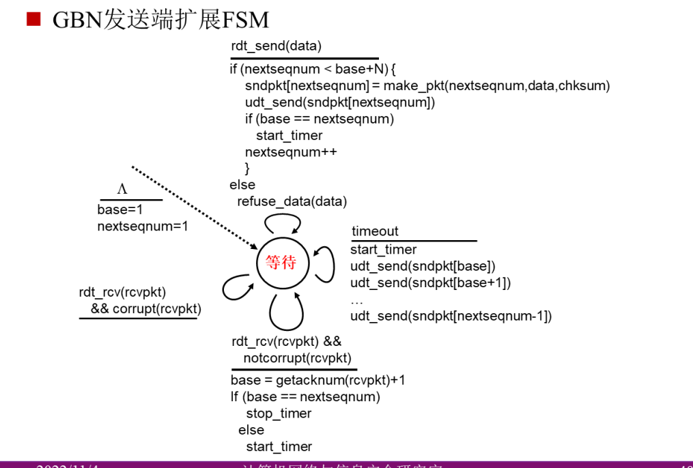
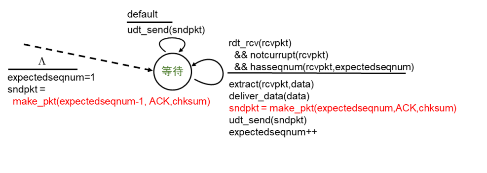
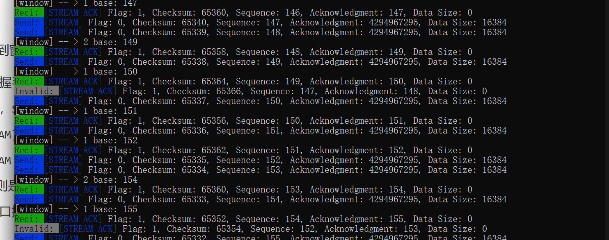
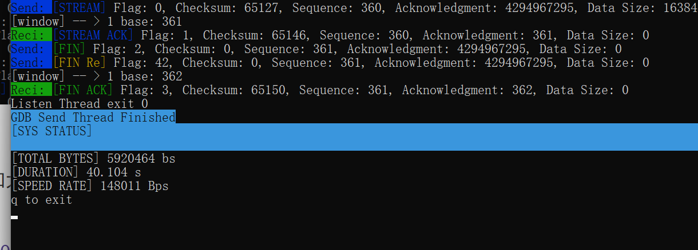
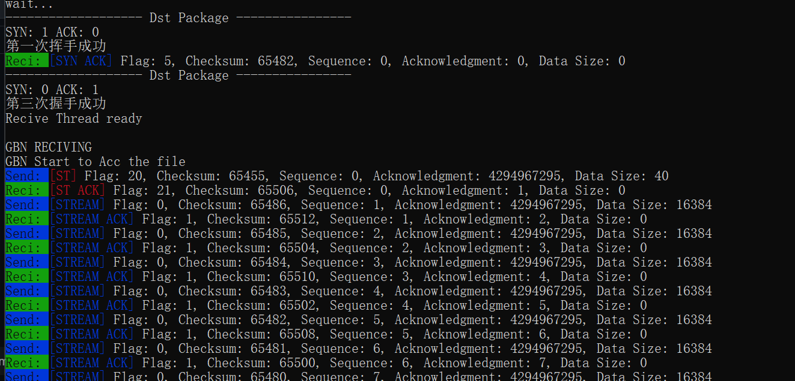
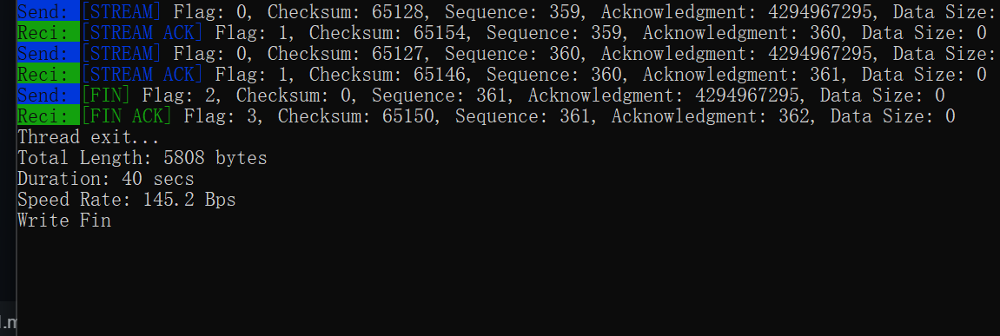

学号：2111252  姓名：李佳豪 

代码链接:

## UDP可靠传输-Part02

在实验3-1的基础上，将停等机制改成基于滑动窗口的流量控制机制，发送窗口和接收窗口采用相同大小，支持累积确认，完成给定测试文件的传输。

### GBN实验原理要点

1. **滑动窗口机制**：GBN使用固定大小的发送窗口来控制发送的数据量。发送窗口内的所有数据包可以在没有收到确认的情况下连续发送，而**发送端**要对每一个每个数据包编写**唯一的序号**，用于接收方识别和确认，将“窗口”内的所有数据包发送

2. **确认和超时**：**接收方**收到数据包后，发送确认（ACK）回复，而接受端的发送的每一个ack值一定是自己希望获得下一个数据包的seq值，保证了接受数据包的**顺序可靠性**。如果**发送方**在设定的超时时间内未收到ACK，它假定该数据包已丢失。

3. **重传机制**：在超时后，发送方不仅重传丢失的数据包，而且还重传该数据包之后的所有数据包（即窗口内的剩余数据包）。

4. 握手与挥手：和上一次实验一样为了保证**传输通道的可靠**，增加一个**三次握手状态机**；而**二次挥手**嵌入在文件传输的结尾，在发送端发送到最后一个数据包时，将这个包报头的FLAG的`FIN`置位，意思将发送完毕，之后等待接收端回复`[FIN, ACK]`后结束发送线程。

   **值得注意**的是，当延迟很小（或者每一个包都有相同的时延），且接收端的丢包率为0，此时GBN退化为Part-01中的停等机制；原因则是这种情况，发送端发送的每一个数据包很快接受到了相应的回复，窗口向右移动1...

状态机参考课程中：





### 报文设计

与上一次实验相比，GBN和SR机制中，FLAG标志位增加RE位，意思重传，同时选项内增加16位WINDOW，意位窗口大小。

```c++
 0              7 0             7 0                            15
+---------------------------------------------------------------+
|         	 Flag			    |          Checksum            |
+---------------------------------------------------------------+
|                         Sequence Number                       |
+---------------------------------------------------------------+
|                     Acknowledgment Number                     |
+---------------------------------------------------------------+
|           Payload Length        |       Window Length         |
+---------------------------------------------------------------+
|                             Data                              |
+---------------------------------------------------------------+

```

| 字段名称              | 大小 (位) | 描述                               |
| --------------------- | --------- | ---------------------------------- |
| Flag                  | 16        | 0... **RE** St  Status SYN ACK FIN |
| Checksum              | 16        | 整个报文的校验和                   |
| Sequence Number       | 32        | 报文的序列号                       |
| Acknowledgment Number | 32        | 确认序列号                         |
| Payload Length        | 16        | Data的长度                         |
| WindowLength          | 16        | 窗口大小                           |
| Data                  | ——        | 实际数据                           |

### 程序设计

1. **发送端**  异步的发送和接受

   1. **窗口缓存区** 本质是一个队列，便于将ack对应的数据包之前的全部数据包全部pop。下面展示核心函数`GBNpop`，在接受线程调用，若返回-1，则是表示当前接受的`ACK`没有在缓存区匹配的；若返回n(n>0)，表示匹配到第n个数据包，并且已经将这n个数据包pop出去。

      ~~~c++
   class pQueue{ 
      public:
          vector<Udp*> data;
      	
          ... ...
          //return  -1 ACK小于窗口内最小值 >1 ACK大于循环第一个元素pop
          int GBNpop(const Udp& value){
              int va = value.header.ack;
              if ( this->empty() || va < (this->front()->header.seq + 1) )
                  return -1;
            //注: va大于front,表示回复的ack丢失或者延迟，但是接受方已经收到，可以累计确认
              else {
                  int rst = va - this->front()->header.seq;
                  int n = rst;
                  while (n--)
                      this->pop();
                  return rst;
              }    
          }
      };
      
      ~~~
   
      

   2. **发送线程**：将窗口内的数据按照序列发送，之后将其放入一个缓存区等待被ACK；同时还需要在超时重传时对超时的包进行重新发送

      

   3. **接受线程**：接受ACK包，将**对应**的存在缓存区内**待确认**的包进行确认，注意确认机制是累积确认，即这个ACK确认的是对应缓存区内包之前的所有数据;另外，它负责超时，之后通知发送线程进行重发

      ~~~c++
       //重传
      while (recvfrom(s->s, ReciBuffer, PacketSize, 0, (struct sockaddr*)s->dst_addr, &dst_addr_len) <= 0)
              {
                  if (clock() - s->timer > 10*MAX_TIME)
                      //重发
                  {
                      s->timer = clock();
                      s->Re = 1;  //两个线程共有的标志位Re，表示重发
                  }
              }
      
      
      ~~~

      
   
      

2. 接收端

   只需要根据接受到的数据包，进行判断，因此开一个线程接受，再结合状态控制进行发送。基本逻辑和停等机制下的接收端相同，差异只在只有`expect_ack`的机制与收到非法数据包是、重新发送`expect_ack`包。

   - 首先有一组状态，最后根据他们决定当前回应ACK的Header ；声明指向文件的`iter = reci->FileBuffer`，用于将接受的报文写入。

     ~~~c++
     bool fin = 0;
     bool st = 1;
     //bool RE = 0;
     int expect_ack = 1;
     int seq = 0;
     ~~~

   - 若通过校验和、判断接受的ack是否是自己想要的，若不是，则重新发送自己`expect_ack`的数据包;否则根据当前状态和`expect_ack`发送ACK

     ~~~c++
         while (reci->reci_runner_keep && !fin) {
             if (fin || recvfrom(reci->s, buffer, PacketSize, 0, (sockaddr*)reci->send_addr, &send_addr_size) <= 0)
                 continue;
             //接受到数据包
             Udp* dst_package = (Udp*)buffer;
             print_udp(*dst_package, 1);
     		//校验和检验 seq检验是否连续 否则置为r（重发位）
             if (!dst_package->cmp_cheksum() || !(dst_package->header.seq + 1 == expect_ack))
             {
                 //cout << "---------- Lost or CheckSum error ---------\n" << endl;
                 reci->package->header.set_r(1);
                 reci->ThreadSend();
                 reci->package->header.set_r(0);
                 continue;
             }
             // 通过校验和  
     
             if (dst_package->header.get_st())
                 reci->InforBuffer += dst_package->payload;
     
             else {
                 st = 0;
                 memcpy(iter, dst_package->payload, dst_package->header.data_size);
                 iter += dst_package->header.data_size;
             }
     
             if (dst_package->header.get_Fin())
     	  //fin报文收到后，则完全收到了，回复一个fin报文，让sender结束。即挥手第二次
                 fin = 1;
     
             reci->package->header.set_Ack(1);
             reci->package->header.set_St(st);
             reci->package->header.set_Fin(fin);
             reci->package->header.seq = seq++;
             reci->package->header.ack = expect_ack++;
             reci->ThreadSend();
     
         }
     
         Sleep(100);
         cout << "Thread exit... \nTotal Length: " << reci->bytes << " bytes\n" << "Duration: " << (double)((clock() - send_st) / CLOCKS_PER_SEC) << " secs" << endl;
         cout << "Speed Rate: " << (double)reci->bytes / ((clock() - send_st) / CLOCKS_PER_SEC) << " Bps" << endl;
         reci->to_file();
         return 1;
     }
     ~~~

     

   

### 			实验结果

#### 实验数据

| 传输协议 | 测试文件       | 吞吐率     | 传输时延 |
| -------- | -------------- | ---------- | -------- |
| GBN      | helloworld.txt | 152078 Bps | 11.374 s |
| GBN      | 1.jpg          | 155805 Bps | 12.724 s |
| GBN      | 2.jpg          | 148011 Bps | 40.044 s |
| GBN      | 3.jpg          | 148005 Bps | 81.073 s |

参数

> 丢包率:0.05   延迟 50-300ms   窗口内连续发送延迟 50ms


#### 实验截图

**发送端**，涉及到窗口的改变，输出日志内容有如下信息：

- 首先是三次握手状态信息，输出[SYN ACK]相关报文
- 文件传输中，`Send:[ST]`报文是第一个数据包，里面包含了传输文件的描述信息，名字、大小等
- `Send:[STREAM]`报文是正常传输的报文，[STREAM RE]则是重传的数据包
- `Reci:[STREAM ACK]`是**正常**回复、且使得发送端窗口**变化**的**有效**`ack`报文
- `[INVALID]` 则是累积确认中，`n+1`的`ack`已经接受，但是此时 `n` 的`ack`才到达，这个 `n` 就是`INVALID`。
- 此外还有窗口挪动的信息，`[window] -- > n base: x` ，`n`是窗口移动的位数，`x`是此时窗口的左区间



最后计算、输出吞吐率相关指标



**接收端**由于窗口大小为1，不存在窗口改变。输出的日志信息中如下，它输出的报文是上述发送端的子集。




